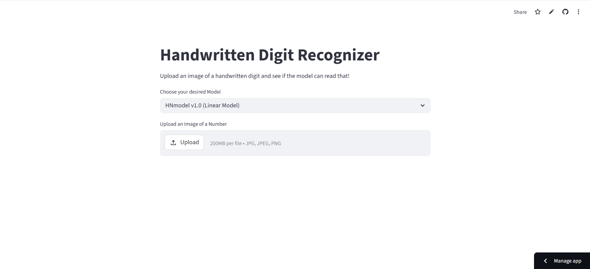
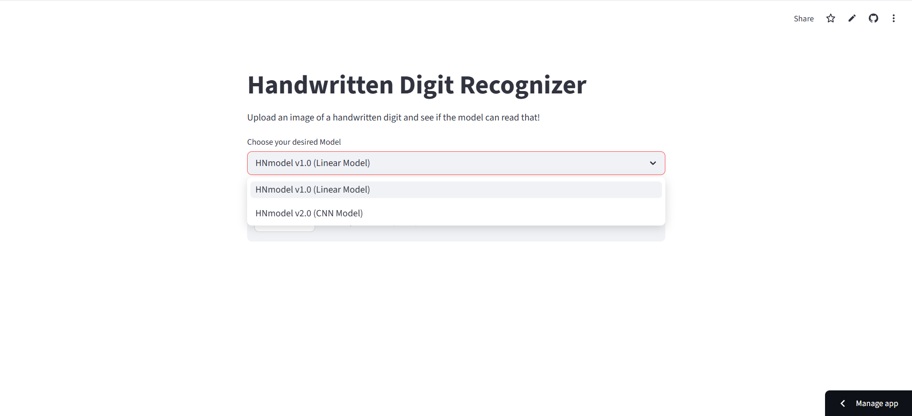
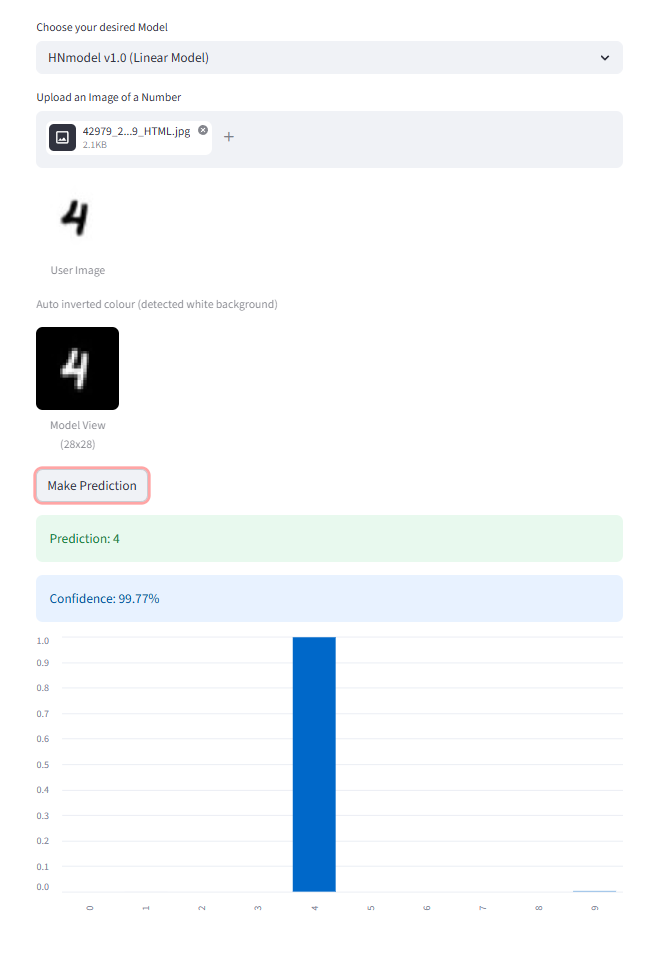
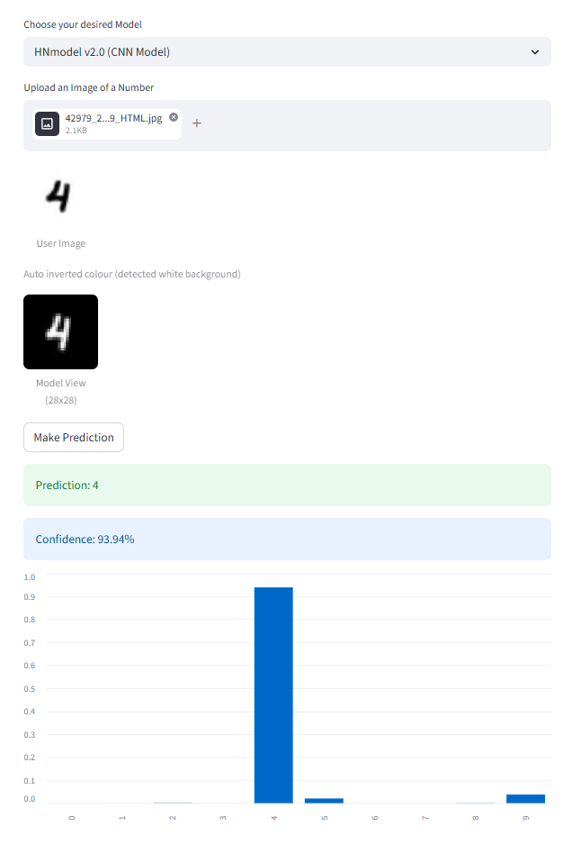

# Handwritten Numbers Detector

[![Streamlit App]
(https://static.streamlit.io/badges/streamlit_badge_black_white.svg)]
(https://handwritten-numbers-detector-tahsinttalha.streamlit.app/)

This project features two models, linear and CNN, both trained on the MNIST dataset. The purpose of this project was to understand how DL models work and how to implement them in a real-world project. So I also created a Streamlit app to create an interactive environment where users can test both models and understand their confidence level in any particular digit. Some screenshots of the application working are provided below with screenshots.

  
  
Figure 1: App First Look

  
  
Figure 2: App Dropdown Containing Both the Linear and CNN Models

  
  
Figure 3: Linear Model in Action

  
  
Figure 4: CNN Model in Action

## Tech Stack
- Python
- TensorFlow / Keras
- Streamlit
- NumPy
- Matplotlib

## Run Locally
``git clone https://github.com/tahsinttalha2/handwritten-numbers-detector
pip install -r requirements.txt
streamlit run app.py``

Check out the models from here: https://handwritten-numbers-detector-tahsinttalha.streamlit.app/
